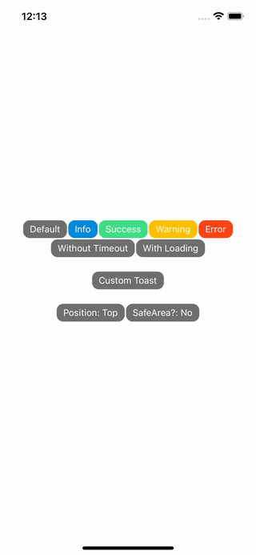

<h1 align="center">react-native-customizable-toast</h1>

<p align="center">
  <p align="center">yet another toast library based on reanimated 2 layout animations</p>
  <p align="center" style="background:#943740;">
    
  </p>
</p>


## Features
- Imperative API
- Fully Customizable
  - Custom toast renderer
  - Custom vertical swipe animations
  - Custom layout animations
  - Display from top (default) or from bottom
- Swipeable both vertical and horizontal
- Fully typed with TypeScript

## Requirements
- react-native-reanimated ^3
- react-native-gesture-handler ^2

## Installation

```sh
npm install react-native-customizable-toast
```

## Basic Usage
Use default Toaster component in your base component.

```js
import { Toaster } from "react-native-customizable-toast";

export default function App() {
  return (
    <View style={{ flex: 1 }}>
      <Content />

      <Toaster />
    </View>
  );
}

```

Use ToasterHelper to show a simple toast.

```js
import { ToasterHelper } from "react-native-customizable-toast";

ToasterHelper.show({
  text: 'lorem ipsum',
  type: 'success',
  timeout: 5000,
});

```

## React Native Modal (React Native Screens)
When using a Modal with React Navigation, the toasts appear under the Modal (https://github.com/software-mansion/react-native-screens/issues/525).
The solution is to use FullWindowOverlay to wrap the base component.

```js
import { Toaster } from "react-native-customizable-toast";
import { FullWindowOverlay } from 'react-native-screens';

export default function App() {
  return (
    <View style={{ flex: 1 }}>
      <Content />

      <FullWindowOverlay>
        <Toaster />
      </FullWindowOverlay>
    </View>
  );
}
```

## Default Methods

```js
// show toast
const toast = ToasterHelper.show({
  text: 'custom string',
  timeout: 5000,
  type: 'info',
  onPress: () => {},
  dismissible: false,
  loading: true,
});

// update toast
ToasterHelper.update(toast, {
  dismissible: true,
  loading: false,
});


// hide toast
ToasterHelper.hide(toast)
```
## Customizing

In case that you don't want to use default Fade animations and want to replace them with Slide animations and specify custom properties for toast message;

First create responsible type for your custom toast.
```js
type MyCustomToaster = {
  text: string;
  dismissible?: boolean;
  backgroundColor?: string;
};
```

Create ref object to use toaster methods via imperative api. You can create helper object to get rid of 'current' keyword.
```js
const CustomToasterRef = createRef<ToasterMethods<MyCustomToaster>>();


// optional
export const CustomToasterHelper = {
  show: (options: MyCustomToaster) => CustomToasterRef.current?.show(options)!,
  hide: (id: string) => CustomToasterRef.current?.hide(id),
  filter: (fn: (value: MyCustomToaster, index: number) => void) =>
    CustomToasterRef.current?.filter(fn),
  update: (id: string, options: Partial<MyCustomToaster>) =>
    CustomToasterRef.current?.update(id, options),
};
```

Next, create a toaster component based on ToasterBase, attach the ref object to it and customize a bit. You can use Reanimated 2 Layout Animations.

https://docs.swmansion.com/react-native-reanimated/docs/next/api/LayoutAnimations/exitAnimations

```js
import {
  SlideInLeft,
  SlideOutRight,
} from 'react-native-reanimated';

export const CustomToaster = () => {
  return (
    <ToasterBase
      entering={SlideInLeft}
      exiting={SlideOutRight}
      ref={CustomToasterRef}
    />
  );
};
```

By default onSwipeEdge callback removes all toast messages from toaster but we want to remove dismissible toasts.
```js
export const CustomToaster = () => {
  return (
    <ToasterBase
      entering={SlideInLeft}
      exiting={SlideOutRight}
      ref={CustomToasterRef}
      onSwipeEdge={({ filter }) => filter((e) => !e.dismissible)} // <--- add
    />
  );
};
```

Since we want to use a custom toast that has custom properties, we need to create a Toast component. We will use useToast hook to get the toast data from current context.
```js
const CustomToastComponent = () => {
  const {
    text,
    hide,
    dismissible,
    backgroundColor = '#222',
  } = useToast<MyCustomToaster>();

  return (
    <Swipeable onSwipe={hide} disabled={!dismissible}>
      <View style={styles.container}>
        <TouchableOpacity
          disabled={!dismissible}
          style={[
            styles.touchable,
            {
              backgroundColor,
            },
          ]}
          onPress={hide}
        >
          <Text style={styles.text}>{text}</Text>
        </TouchableOpacity>
      </View>
    </Swipeable>
  );
};

const styles = StyleSheet.create({
  container: {
    paddingHorizontal: 10,
    paddingVertical: 2,
  },
  touchable: {
    alignItems: 'center',
    flexDirection: 'row',
    borderRadius: 5,
    padding: 10,
    minHeight: 40,
  },
  text: {
    color: '#ffffff',
    flex: 1,
  },
});
```

Update CustomToaster component to render out custom toast.

```js
export const CustomToaster = () => {
  return (
    <ToasterBase
      entering={SlideInLeft}
      exiting={SlideOutRight}
      ref={CustomToasterRef}
      onSwipeEdge={({ filter }) => filter((e) => !e.dismissible)}
      render={CustomToastComponent} // <--- add
    />
  );
};
```

Create toast via your helper.
```js
CustomToasterHelper.show({
  text: 'message',
  dismissible: false,
  backgroundColor: 'RANDOM HEX COLOR'
});
```


<h2>🎉Congratulations!!</h2>
<h3>You have your custom implementation of react-native-customizable-toast.</h3>

Dont mind FPS :(


<h2>What if you wanted to change the vertical stack animation to another animation?</h2>

Create Reanimated 2 worklet that returns style object. Dont forget to take a look at [ToastItemProps](https://github.com/kubilaysalih/react-native-customizable-toast/blob/main/src/typings.ts#L45). You can find lots of animated values and toast properties that you can combine with the provided link.
```js
export const clamp = (
  value: number,
  lowerBound: number,
  upperBound: number
) => {
  'worklet';
  return Math.min(Math.max(lowerBound, value), upperBound);
};

export const customStyleWorklet = ({
  itemLayout: { y },
  gesture: { translationY },
  properties: { index },
}: ToastItemProps) => {
  'worklet';

  return {
    transform: [
      {
        translateY: clamp(translationY.value, -y.value, 0),
      },
      {
        translateX: interpolate(
          -translationY.value - y.value,
          [0, 100],
          [0, index % 2 ? 1000 : -1000],
          Extrapolate.CLAMP
        ),
      },
    ],
  };
};

```

Use custom style worklet in your toaster component.
```js
export const CustomToaster = () => {
  return (
    <ToasterBase
      entering={SlideInLeft}
      exiting={SlideOutRight}
      ref={CustomToasterRef}
      onSwipeEdge={({ filter }) => filter((e) => !e.dismissible)}
      render={CustomToastComponent}
      itemStyle={customStyleWorklet}  // <--- add
    />
  );
};
```


Dont mind FPS again :(


You can find full implementation in [CustomToaster](https://github.com/kubilaysalih/react-native-customizable-toast/blob/main/example/src/CustomToaster/CustomToaster.tsx)

## TODO
- [ ] Better README.md or docs

## Contributing

See the [contributing guide](CONTRIBUTING.md) to learn how to contribute to the repository and the development workflow.

## License

MIT
